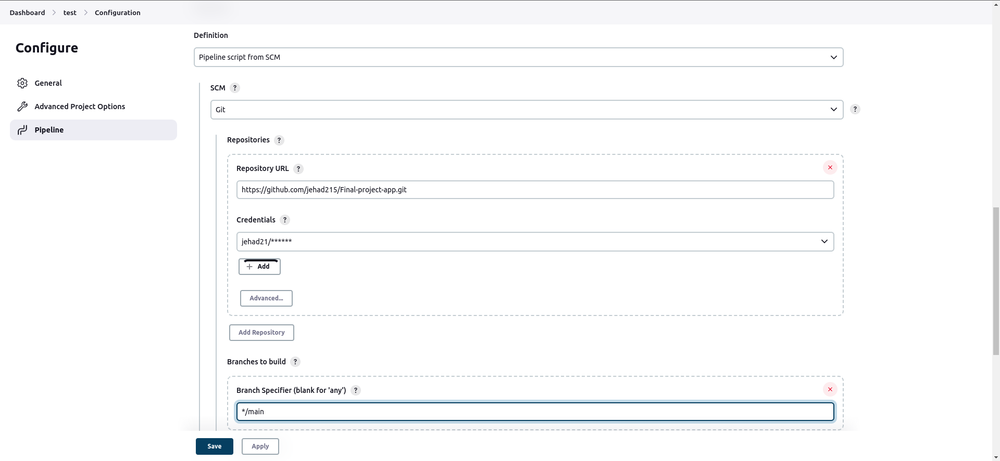
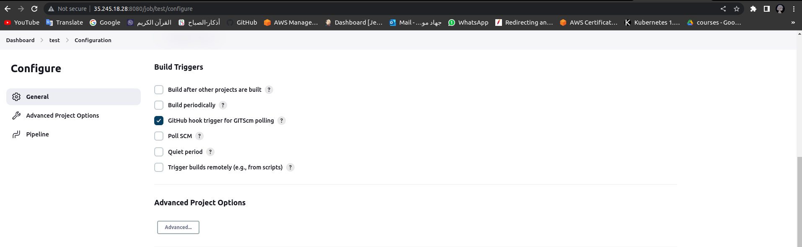
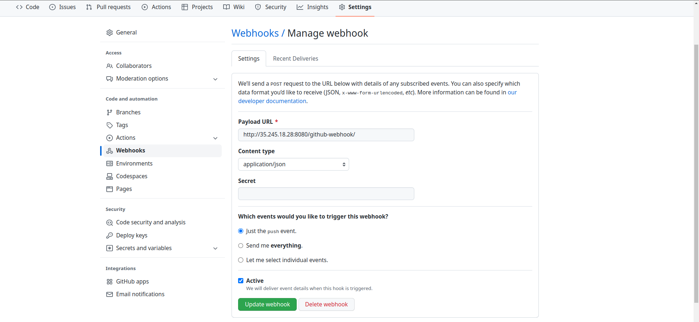
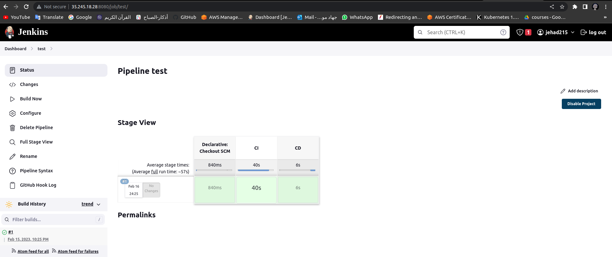
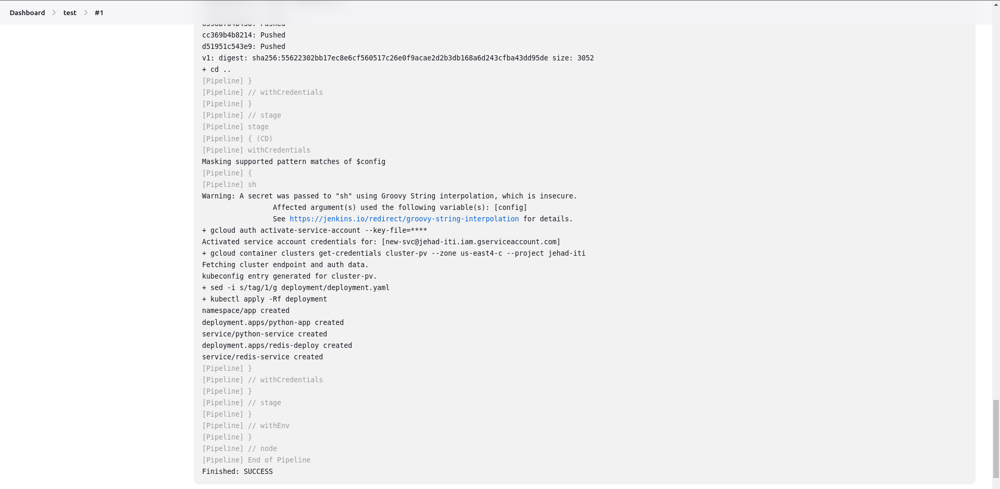

## CI/CD Pipeline To Deploy a backend app

### Second part of project: CI/CD

### Create credintials in Jenkins:
 - Dockerhub credintials
 - Credintials for the new service account 


### CI pipeline:
#### 1. Pull code from GitHub


#### 2. Create Dockerfile
- to dockerize the app
```bash
$ docker build -t jehad21/app .
$ docker push jehad21/app
```
#### 3. Trigger CD pipeline to run
 - On jenkins


 - On GitHub 


###  Least but not least



###  And Voila! Application is successfully deployed


### Finally: Destroy all resources
```bash
$ terraform destroy
```
